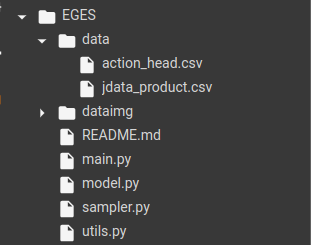
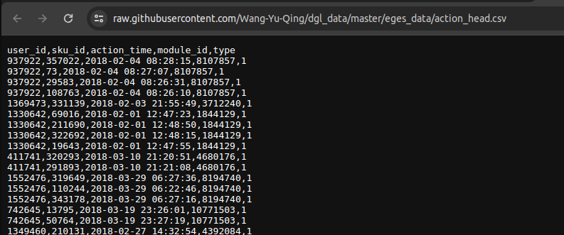
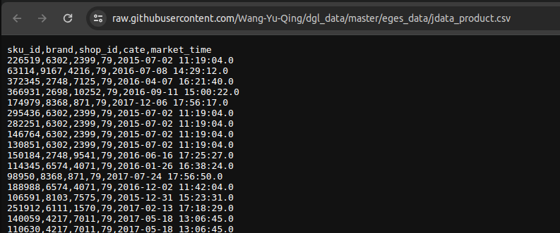

# Get data 

data gồm 2 file `action_head.csv` và `jdata_product.csv` được bỏ vào folder `data` được tổ chức như sau:

    !wget https://raw.githubusercontent.com/Wang-Yu-Qing/dgl_data/master/eges_data/action_head.csv -P data/
- user_id,sku_id,action_time,module_id,type
split by `,`

    Ví dụ:

    user_id,sku_id,action_time,module_id,type

    937922,357022,2018-02-04 08:28:15,8107857,1

    !wget https://raw.githubusercontent.com/Wang-Yu-Qing/dgl_data/master/eges_data/jdata_product.csv -P data/
- sku_id,brand,shop_id,cate,market_time
split by `,`

    Ví dụ:

    sku_id,brand,shop_id,cate,market_time

    226519,6302,2399,79,2015-07-02 11:19:04.0

# notebook
    https://colab.research.google.com/drive/1TMi4oU7kkFzKlYdSIfdEuTJKyej-V_Ny#scrollTo=_9v-Hpqdk6L_